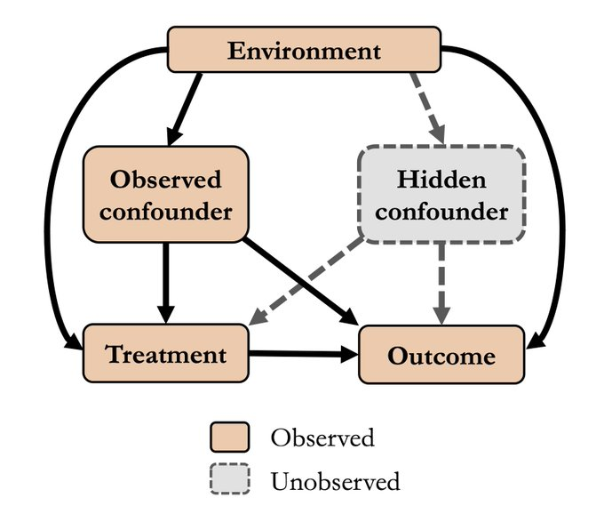

causal-falsify: Causal falsification algorithms in Python
=========================================================

.. image:: https://img.shields.io/pypi/v/causal-falsify.svg
   :target: https://pypi.org/project/causal-falsify
.. image:: https://img.shields.io/pypi/l/causal-falsify
   :target: ./LICENSE

A Python library with multiple algorithms for falsifying the unconfoundedness assumption
in multi-environment (or, multi-source) datasets.  
Source code: https://github.com/RickardKarl/causal-falsify

Here is an example causal directed acyclic graph where these algorithms can be applicable:

Installation
------------

Install from PyPI:

.. code-block:: bash

   pip install causal-falsify

.. toctree::
   :maxdepth: 3
   :caption: Documentation
   :glob:

   algorithms
   examples
   api/causal_falsify
   issues
   citing
